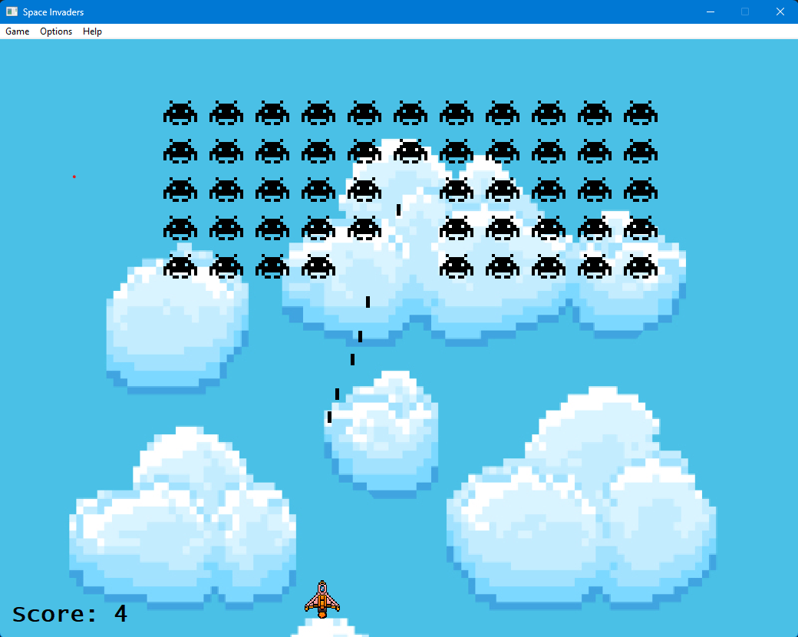

# Galactic Defenders: WinAPI Edition 🚀

**Galactic Defenders** is a retro-style space shooter game inspired by the classic **Space Invaders**. Built using **WinAPI** as a part of Programming in graphical environment course, this game brings a nostalgic arcade experience to your desktop with smooth graphics and simple gameplay mechanics.
  
## 📝 Game Description

In **Galactic Defenders**, you control a spaceship at the bottom of the screen, defending Earth from waves of invading alien spaceships. Your mission is to shoot down all enemies.

## 🚀 Features

- **Classic Space Invaders Gameplay**: Battle against aliens.
- **Background Customization**: Choose any bitmap as a backround via dialog window and set it to one of four display styles, or simply set a solid color. 
- **Saving Settings**: The game automatically reloads the last settings after being restarted.
- **Shortcuts support**: Use shortcuts to change window size and background.
- **WinAPI Graphics**: Built using WinAPI for smooth 2D graphics and animation.
- **Last Score Tracking**: Keep track of your last performance and challenge your friends.
- **Responsive Controls**: Easy-to-use keyboard controls for a fast-paced gaming experience.
- **Retro Theme**: Enjoy a nostalgic pixelated style inspired by 80s arcade games.

## 🎮 Installation

1. Clone the repository

## 🕹️ User Manual

### **Getting Started**

1. **Launch the Game**: 
   - Run the `GalacticDefenders.exe` to start the game.
   
2. **Gameplay Instructions**:
   - **Move Left/Right**: Use the left and right arrow keys to move your spaceship across the screen.
   - **Shoot**: Press the **Spacebar** to shoot lasers at the aliens.
   - **Destroy the Invaders**: Your goal is to destroy all the alien invaders.
   
3. **Scoring**:
   - Each alien you destroy earns you points.
   - The game keeps track of your last score, which is displayed after each session.

### **Controls**

- **Arrow Keys**: Move your spaceship left and right.
- **Spacebar**: Shoot laser beams.

